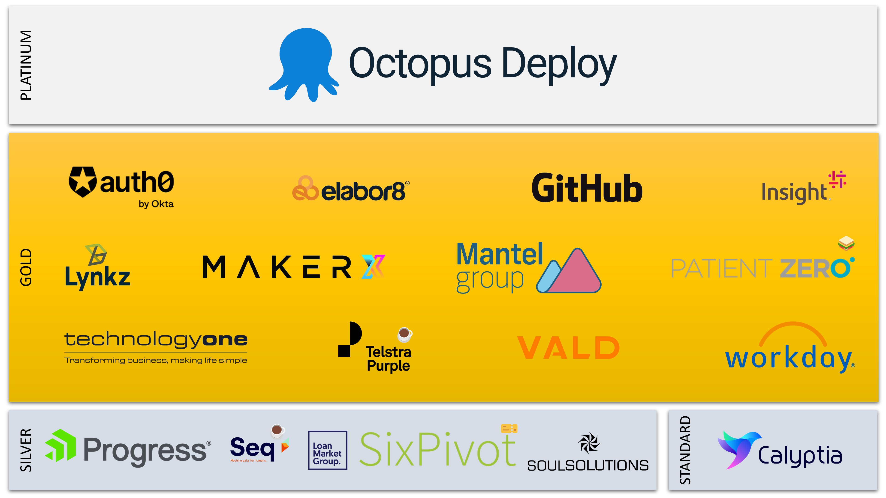

# README

The DDD Brisbane [monorepository](https://en.wikipedia.org/wiki/Monorepo)

## Sponsors

Thank you to all the sponsors!

## The repositories

| Repository | Description |
|-|-|
| Core/ | Core packages |
| DDDBrisbane.API.Basket/    | Basket API |
| DDDBrisbane.API.Customer/ | Customer API |
| DDDBrisbane.API.Delivery/ | Delivery API |
| DDDBrisbane.API.Product/   | Product API |
| DDDBrisbane.API.Review/   | Review API |
| Deployment/ | Common Deployment Definitions |
| Docs/ | Documentation |

To update the repositories above run this on Bash:

> ls -d */ | xargs -L1 -I{}  echo "| {} | Add description |"
